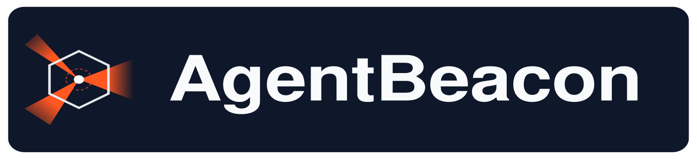
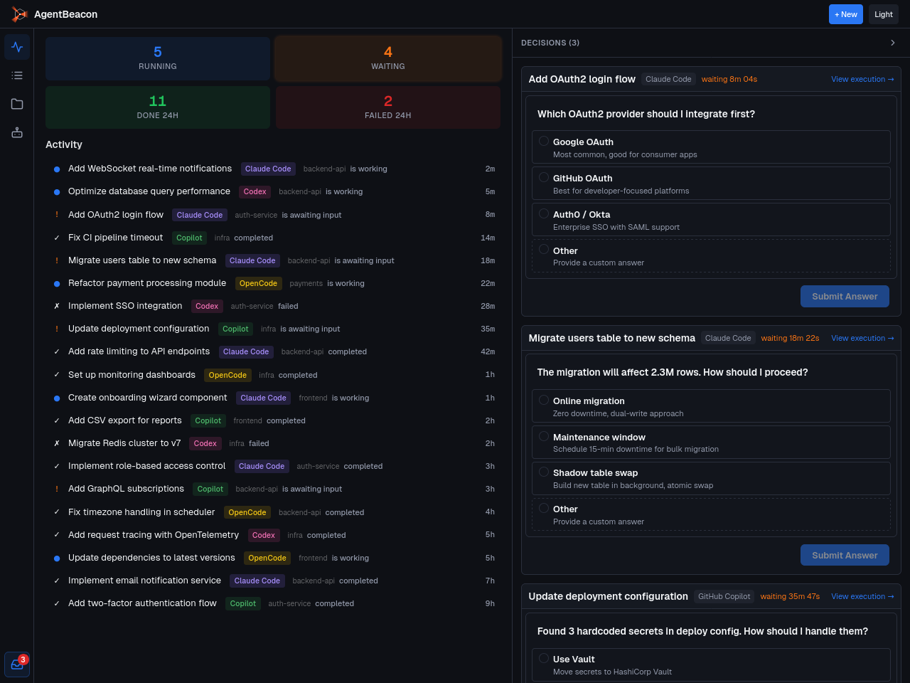
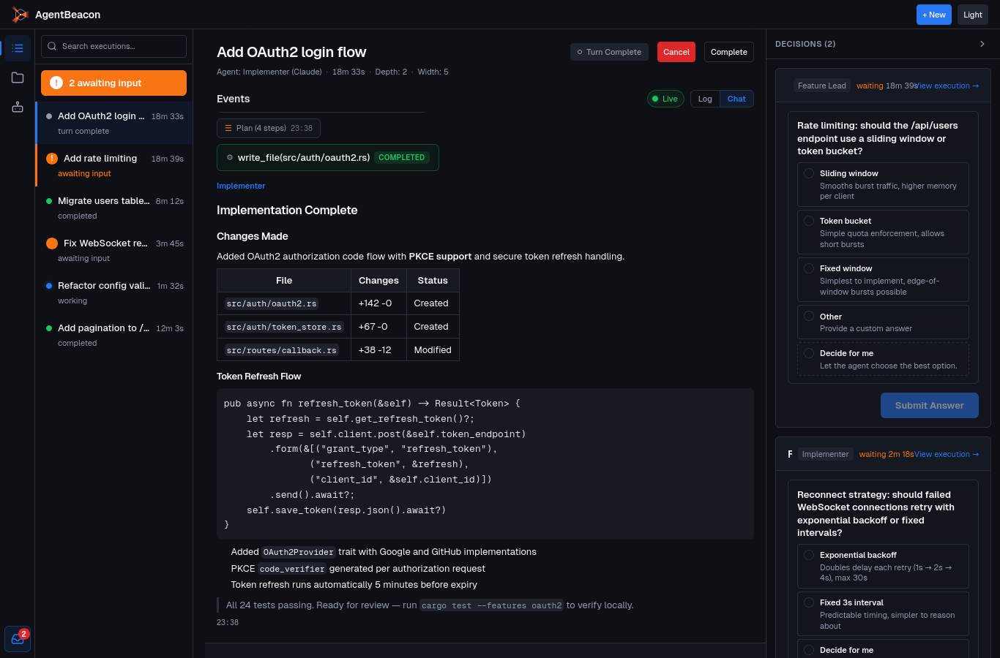

<p align="center">
  
</p>

<p align="center">
  <strong>Stop babysitting AI. Start delegating.</strong>
</p>

<p align="center">
  <a href="#how-it-works">How It Works</a> &middot;
  <a href="#why-it-works-this-way">Why It Works</a> &middot;
  <a href="#quick-start">Quick Start</a> &middot;
  <a href="LICENSE">Apache 2.0</a>
</p>


---

## The Problem

If you use AI coding agents, you've probably got several running right now across different terminals, working on different features, and each needing attention at unpredictable times. The coordination is all on you: context-switching between terminals, copying output between tools, trying not to drop threads across multiple workstreams.

Most multi-agent tools either leave coordination entirely to you (fancy session multiplexers) or take it away entirely (opaque orchestration where you hope for the best).

AgentBeacon is a **decision operations center** that combines the best of both. Agent teams iterate and review each other's work autonomously. You work through a single queue of structured choices across all your running features instead of babysitting terminals. Every detail is logged, so you can dig in to the individual tool call level when you need to. Either way, you ship software you can actually stand behind, at a pace that wasn't possible before.


## What AgentBeacon Does

AgentBeacon coordinates teams of AI agents working on your codebase and surfaces only the decisions that need a human. You assign a feature to a lead agent, it delegates to implementers and reviewers, manages iteration loops, and presents you with a queue of structured questions.

The interaction model is closer to **triaging an inbox** than monitoring a terminal:

1. Open the app, see 3 pending decisions across your running features
2. Answer them in 90 seconds
3. Glance at the activity feed for progress
4. Get back to your own work

One engineer, multiple features in flight, decisions as the main touchpoint.

<p align="center">
  
</p>

## Quick Start

```bash
git clone https://github.com/adrq/agentbeacon.git
cd agentbeacon
make all
make run
# Open http://localhost:9456
```

**Prerequisites:**
- Rust toolchain and Node.js 20+ (`uv`/Python 3.10+ if you want to run tests)
- At least one coding agent CLI installed: [Claude Code](https://docs.anthropic.com/en/docs/claude-code), [Codex CLI](https://github.com/openai/codex), [Copilot CLI](https://github.com/github/copilot-cli), [OpenCode](https://github.com/anomalyco/opencode), or any [ACP](https://spec.agentcontextprotocol.org/)-compatible agent
- An API key or subscription for the corresponding provider

**Note:** AgentBeacon orchestrates coding agents you already have installed — it doesn't bundle or replace them.

## How It Works

**1. Configure agent teams.** Define agents with different providers and roles — a Claude-based implementer, a GPT-based reviewer, a lead that coordinates them. Different models have different blind spots; cross-model review catches what any single model misses.

**2. Start an execution.** Give it a task: "Add rate limiting to the /api/users endpoint." The lead agent breaks the work down and delegates to its team.

**3. Answer decisions from the queue.** When the team hits a genuine ambiguity — architecture choice, library preference, scope clarification — the lead surfaces a structured question. You pick an option and the team continues.

**4. Review converged output.** After agents iterate and converge, review the result. Each execution maintains a full decision log so you can trace why things were built the way they were.

<p align="center">
  
</p>

## Why It Works This Way

**Decision queue as the interface.** Agents surface structured questions with labeled options — pick one, write your own, or let the agent decide. Each level in the hierarchy absorbs what it can and only escalates genuine ambiguities upward. Your decision volume stays manageable as the hierarchy deepens. Intermediate agents handle the routine calls so you don't have to.

**Shared knowledge layer.** Every project gets a wiki that any agent can read and write. One agent discovers a codebase convention and writes it down. Another agent, even in a different session days later, finds it through search. This is persistent memory across agents and sessions without bloating context windows. Versioned, full-text searchable, and subscribable so you can watch pages that matter to you.

**Agents talk to each other, not just to you.** Any agent can message any other agent in the hierarchy directly. Two agents negotiate an API contract. A reviewer messages the implementer about a concern. The authority tree governs lifecycle and accountability; communication is open. No copy-paste between terminals, no human relay.

**Protocol-native, self-hosted, provider-agnostic.** Native integrations for [Claude Code](https://docs.anthropic.com/en/docs/claude-code), [Codex CLI](https://github.com/openai/codex), [GitHub Copilot](https://github.com/github/copilot-cli), and [OpenCode](https://github.com/anomalyco/opencode), with [ACP](https://spec.agentcontextprotocol.org/) support for any compatible agent. Built on [MCP](https://modelcontextprotocol.io/) for tool integration and [A2A](https://google.github.io/A2A/) for agent interop. No proprietary protocols. Your code, your machine, your API keys.

**Three primitives, any scale.** The entire coordination model is three operations: `delegate`, `release`, `escalate`. From 3 agents to 100+. Research shows LLM performance degrades with tool count, so the surface is deliberately small. The same primitives work at every level of the hierarchy, whether that's two agents or twenty.

**Designed for future models.** The same three primitives work whether you're delegating a single endpoint or an entire product. As models improve, the scope of what you can delegate grows, and the architecture is deliberately not the bottleneck. Today you operate as a tech lead making per-feature decisions. As the ceiling rises, the same system scales with it.

## Status

**Early release.** Core coordination loop works end-to-end: create executions, delegate to multi-agent teams, answer structured questions, review results with full decision and code change logs.

## Contributing

Contributions welcome. See `AGENTS.md` for development setup and coding conventions.

```bash
make test-all      # Run Rust + Python integration + E2E tests
make pre-commit    # Run pre-commit hooks
```

## License

[Apache 2.0](LICENSE)
